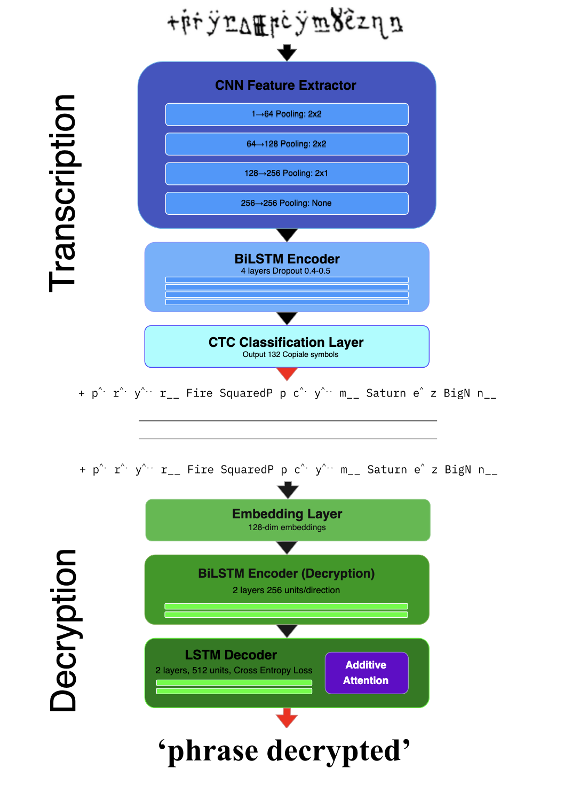
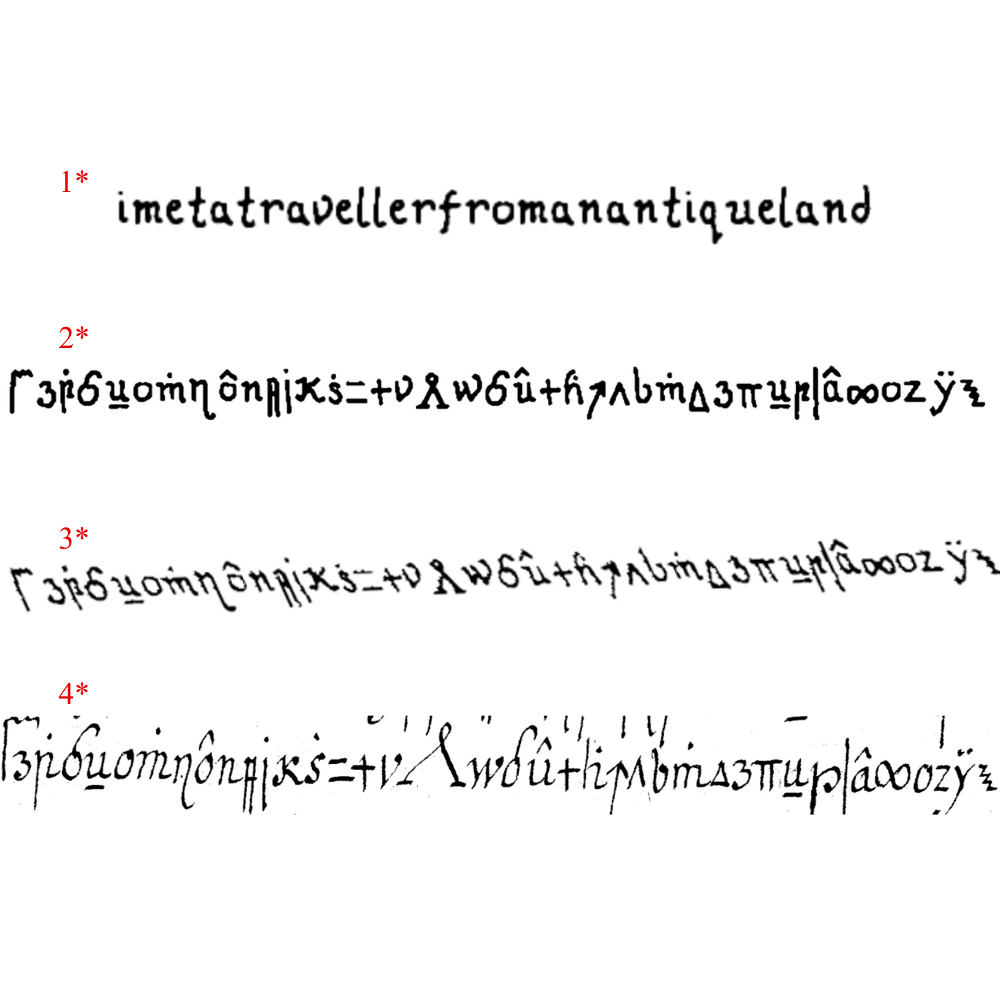

# Pixel Hacking: Direct Image-to-Plaintext Decryption of Historical Encrypted Manuscripts

[](https://www.python.org/downloads/)
[](https://pytorch.org/)
[](https://opencv.org/)
[](https://histocrypt.org/)

This repo serves as the reflection of my work in the DECRYPT project as a scholarship intern at Centre de Visió per Computador (CVC) and my FDP with them. Transcription, decryption and 'pixel-hacking' of the Copiale manuscript.

An end-to-end neural architecture for direct decryption of historical encrypted manuscript images, bypassing traditional transcription stages to reduce error propagation in cipher decipherment.

This project introduces **Pixel Hacking**, a novel paradigm that directly maps encrypted manuscript images to decrypted plaintext in a single model, eliminating the intermediate transcription bottleneck that plagues traditional two-stage cryptanalysis pipelines.

** Submitted to HistoCrypt 2026 - International Conference on Historical Cryptology**


<table>
<tr>
<td width="50%">


*Traditional two-stage pipeline: Transcription → Decryption*

</td>
<td width="50%">


*Pixel Hacking: Direct end-to-end decryption*

</td>
</tr>
</table>


## The Problem

Historical encrypted manuscripts present unique challenges at the intersection of cryptography, paleography, and computer vision. Current decipherment approaches rely on a two-stage pipeline: transcription followed by decryption. This methodology faces three critical limitations:

- **Error Propagation**: Transcription errors compound during decryption, corrupting final output
- **Manual Bottleneck**: Symbol transcription requires extensive expert labor and limits scalability  
- **Information Loss**: Converting images to discrete symbols discards visual features (confidence, spacing, degradation patterns)

The **Copiale Cipher**—a 105-page 18th-century German manuscript with ~75,000 handwritten characters from a 90+ symbol alphabet—exemplifies these challenges. Despite successful decipherment in 2011, the traditional approach remains vulnerable to cascading errors.

<div align="center">
  
  <p><em><strong>Copiale Sample Image RRC></em></p>
</div>

## Our Solution

**Pixel Hacking** learns the direct mapping from encrypted manuscript images to decrypted plaintext using attention-based sequence-to-sequence architecture. By maintaining continuous visual representations throughout the pipeline, the model:

- Eliminates transcription-related error propagation
- Removes the manual transcription bottleneck
- Captures visual features lost during symbolic conversion
- Enables end-to-end gradient flow for joint optimization

### System Architecture

```
Encrypted Manuscript Image → CRNN Feature Extractor → Attention-Based LSTM Decoder → Decrypted Plaintext
```

**Core Innovation**: Unlike traditional pipelines that commit to discrete symbol decisions early (blocking gradient flow), Pixel Hacking maintains continuous representations, allowing visual features to adapt directly to decryption requirements through end-to-end backpropagation.

## Technical Architecture

### 1. CRNN Feature Extractor
Five-block CNN architecture (1→64→128→256→256→512 channels) with progressive pooling extracts hierarchical visual features. Output feature maps are processed through 2-4 layer bidirectional LSTM (256 units per direction) to produce contextualized visual representations.

**Key Design**: Initialized with pretrained transcription model weights but fine-tuned end-to-end during training, unlike frozen representations in traditional pipelines.

### 2. Attention-Based Decoder
2-layer LSTM decoder (512 hidden units) with 8-head multi-head attention generates plaintext characters autoregressively. At each timestep:
- Query vector from LSTM state
- Multi-head attention computes relevance scores over encoded visual features
- Attended features concatenated with LSTM output
- Linear projection to German alphabet vocabulary

Cross-entropy loss enables end-to-end training with gradients flowing through attention, decoder, and feature extractor.

### 3. Synthetic Data Generation Pipeline
Comprehensive pipeline produces 115,000+ Copiale-like training images from historical German texts (Goethe's *Faust*, Kant's *Critique of Pure Reason*, Lutheran Bible, Stifter's *Nachsommer*):

**Text Processing**: Filtered to 106-character Copiale vocabulary, segmented to 12-40 character lines matching manuscript distribution

**Visual Encoding**: Copiale.ttf font maps Unicode to cipher glyphs through DECRYPT project vocabulary

**Augmentation Suite**: Gaussian noise, random erosion/dilation, gamma correction, Kanungo degradation, geometric transformations (rotation ±3°, shearing, scaling, cropping)

<div align="center">
  
  <p><em><strong>Progression from plaintext to augmented Copiale-like images</strong></em></p>
</div>

## Results & Validation

Comprehensive evaluation across synthetic and authentic historical data:

### Synthetic Data Performance (115,000 images)

| Dataset | Metric | Two-Stage | Pixel Hacking | Δ |
|---------|--------|-----------|---------------|---|
| **Faust (in-dist)** | Token Acc. | 91.3% | **92.4%** | +1.1% |
| | WER | 20.6% | **10.5%** | -49% |
| **Novalis (OOD)** | Token Acc. | 69.5% | **75.8%** | +6.3% |
| | WER | 59.7% | **31.6%** | -47% |

### Original Copiale Manuscript (2,000 images)

| Metric | Two-Stage | Pixel Hacking | Δ |
|--------|-----------|---------------|---|
| Token Accuracy | 39.6% | **51.4%** | +11.8% |
| WER | 89.0% | **76.0%** | -13.0% |
| CER | 43.0% | **39.3%** | -3.7% |

**Key Findings**:
- Pixel Hacking outperforms traditional approach on both synthetic and real data
- Advantage increases under challenging conditions (11.8% on real vs. 1.1% on synthetic)
- Performance gap on real data reflects data scarcity (57× less real than synthetic training examples) rather than fundamental domain incompatibility

### Analysis: The Data Scarcity Paradox

While transcription generalizes well (91.1% accuracy on real manuscripts), decryption performance collapses from 92% (synthetic) to 51% (real). Experiments confirm this stems from insufficient training data rather than quality issues:

- Reducing synthetic training from 115k → 8k images: 92% → 31% accuracy (comparable to synthetic-to-real drop)
- Models require tens of thousands of examples to learn robust linguistic patterns
- Only 2,000 real manuscript images available vs. 115,000 synthetic training samples

Despite severe data limitations, Pixel Hacking's consistent advantage validates that end-to-end learning reduces error propagation regardless of training set size.

## Technical Requirements

**Dependencies**:
```bash
torch>=2.0.0
opencv-python>=4.5.0
numpy>=1.21.0
pillow>=9.0.0
```

**Hardware Requirements**:
- CUDA-capable GPU (8GB+ VRAM recommended)
- ~50GB storage for datasets
- 16GB+ system RAM for training

**Data Sources**:
- Copiale manuscript: [Robust Reading Competition 2024](https://rrc.cvc.uab.cat/?ch=27)
- DECRYPT project vocabulary: [https://de-crypt.org/](https://de-crypt.org/)
- Historical German texts: Project Gutenberg

## Repository Structure

Only dataaset samples were included as the entire size of the datasets is too big.

```
PIXELHACKING-COPIALE/
├── Datasets/
│   ├── CopialeOriginalManuscriptSample/   # Original Copiale manuscript images
│   ├── FaustSample/                       # Synthetic Faust dataset samples
│   └── TextFiles/                         # Source text files for generation
│
├── Pixel Hacking/
│   ├── copialePixelHackingVocabulary.json
│   ├── inferencePixelHackingCaseInsensitive.py
│   ├── inferencePixelHackingCaseSensitive.py
│   └── pixelHackingmodelCreation.py
│
├── Synthetic Data Generation/
│   ├── GenerationTools/
│   │   ├── asteriskRemover.ipynb
│   │   ├── check_stats.py
│   │   ├── copialeCompetitionDecryptionText.ipynb
│   │   ├── datasetSplitter.ipynb
│   │   ├── frankensteiner.ipynb
│   │   ├── lineSplitter.ipynb
│   │   ├── mismatchAnalyzer.py
│   │   ├── symbolGeneration.ipynb
│   │   └── textPreprocess.ipynb
│   ├── augmentor.py
│   ├── CopialeV2.ttf                      # Copiale cipher font
│   └── generator.py
│
└── Transcription-Decryption/
    ├── Decryption/
    │   ├── copialeDecryptionVocabulary.json
    │   ├── decryptionInferenceCaseInsensitive.py
    │   ├── decryptionInferenceCaseSensitive.py
    │   └── decryptionModelCreation.py
    └── Transcription/
        ├── BAROTranscription/
        └── copialeTranscriptionVocabulary.json
```


## Future Enhancements

### Immediate Priorities
- **GAN-based synthesis**: Generate higher-fidelity manuscript images capturing ink flow, pressure variations, and authentic aging patterns beyond current augmentation
- **Semi-supervised learning**: Leverage untranscribed digitized manuscripts to expand training data
- **Cross-cipher evaluation**: Test on Borg, Rammanacoil, and other historical ciphers to assess generalization

### Long-Term Development  
- **Human-in-the-loop systems**: Interactive correction for refining linguistic priors and creating high-quality training data
- **Multilingual extension**: Adapt to non-German historical ciphers
- **Attention visualization**: Explainable AI showing which manuscript regions influence decryption decisions

## Research Impact

This work establishes that:

1. **End-to-end learning outperforms traditional pipelines**: Consistent 6% mean improvement in token accuracy, with advantages amplified under data scarcity
2. **Data quantity matters more than quality**: Performance gaps stem from insufficient examples (2k real vs. 115k synthetic) rather than fundamental domain incompatibility  
3. **Visual feature extraction transfers well**: Transcription maintains 91% accuracy on real manuscripts despite synthetic training
4. **Decipherment requires scale**: Current accuracy (51%) represents performance ceiling with 2,000 training examples; practical deployment requires 10,000-50,000 real manuscript images

**Current State**: Pixel Hacking serves as a tool for augmenting human expert analysis rather than replacing it, offering meaningful accuracy improvements that reduce manual effort in historical cipher decipherment.


## Team & Acknowledgments

**Author**: Marino Oliveros Blanco  
**Supervisor**: Dr. Alicia Fornés (CVC Document Analysis Group)  
**Institution**: Universitat Autònoma de Barcelona, Escola d'Enginyeria & Computer Vision Center (CVC)

**Research Environment**: Computer Vision Center (CVC) - 8 GPUs (6× RTX 3090, 2× Quadro RTX 6000)

**Special Thanks**:
- Alicia Fornés for guidance and supervision
- DECRYPT project for standardized datasets and vocabulary
- Robust Reading Competition for Copiale manuscript images
- Jialuo Chen, Lei Kang, Pau Torras, Marçal Rusiñol for CRNN and augmentation code
- Dr. Josep Lladós and Dr. Ernest Valveny for institutional support

## Key References

- Knight, K., Megyesi, B., & Schaefer, C. (2011). *The Copiale Cipher*. Workshop on Building and Using Comparable Corpora.
- Shi, B., Bai, X., & Yao, C. (2017). *An End-to-End Trainable Neural Network for Image-based Sequence Recognition*. IEEE TPAMI.
- Aldarrab, N., & May, J. (2021). *Can Sequence-to-Sequence Models Crack Substitution Ciphers?* EMNLP.
- Bluche, T., Louradour, J., & Messina, R. (2017). *Scan, Attend and Read: End-to-End Handwritten Paragraph Recognition*. ICDAR.
- Graves, A., et al. (2006). *Connectionist Temporal Classification*. ICML.


*This work represents a proof-of-concept system for historical cipher decipherment. It is intended to augment expert analysis rather than replace human cryptographers.*

---

**Contact**: marino.oliveros@autonoma.cat  
**Project Year**: 2025/26  
